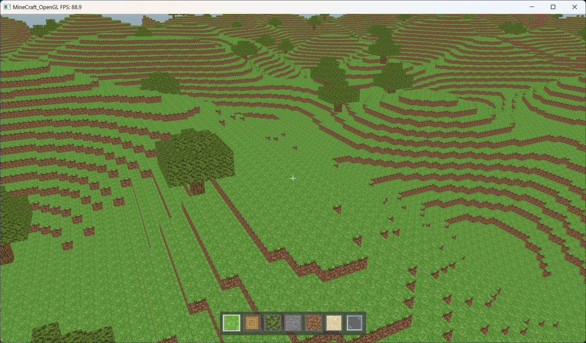
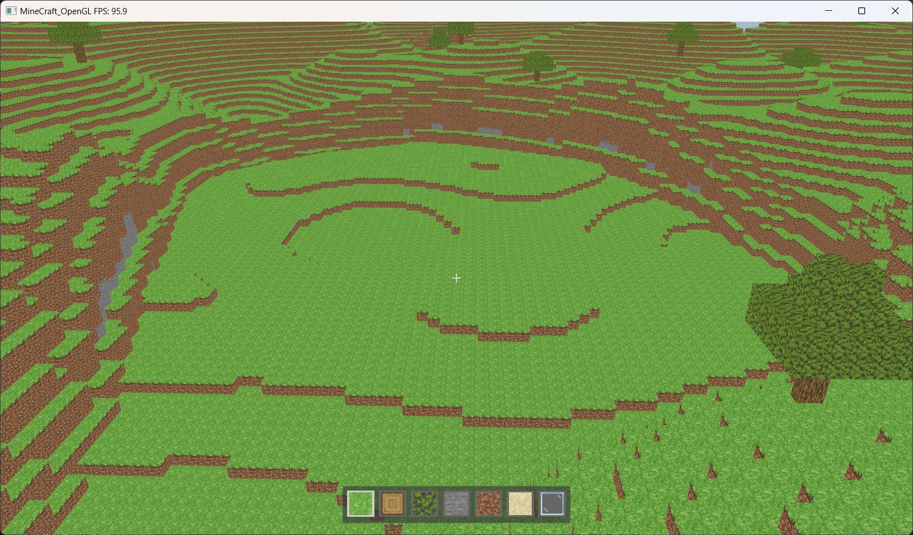
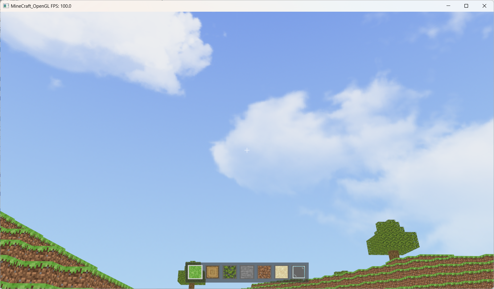
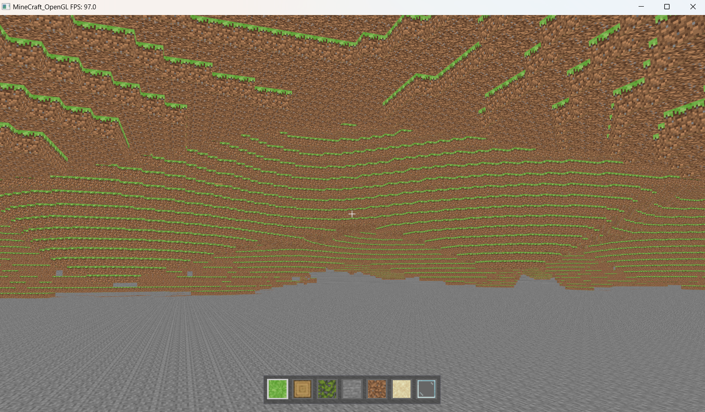
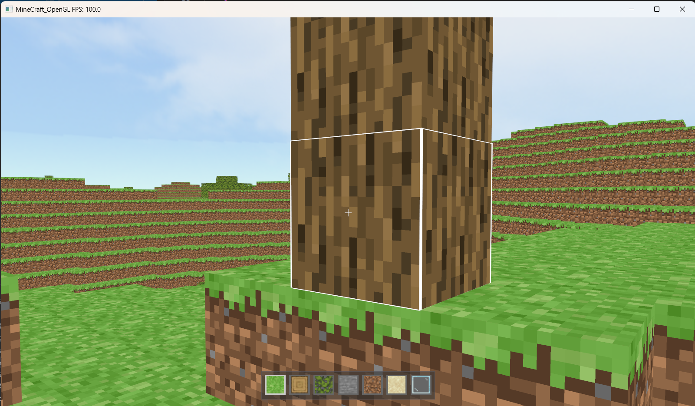
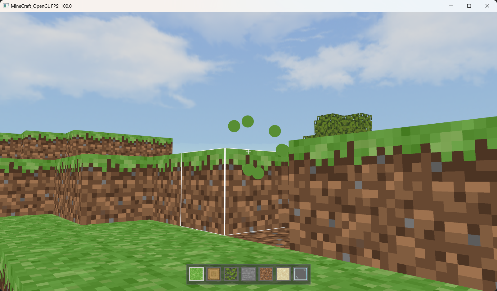
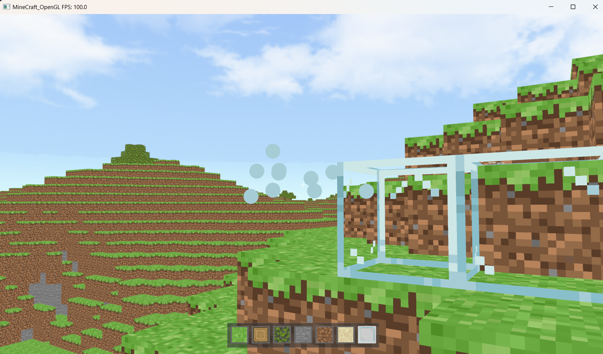

### 硬件
 - 需要一定性能的游戏显卡

### 环境
 - Windows
 - MINGW

### 方块材质下载
https://github.com/Faithful-Pack/Default-Java/tree/1.19.3/assets/minecraft/textures/block

### TODO
 - 优化渲染性能（识别热点，视锥裁剪...）

### 构建 

在 MINGW 环境中编译，确保安装了 MINGW 下 GCC 构建工具链。

```bash
# 仅编译
make # 或 mingw32-make
# 编译加运行
make run
```
如遇到问题，也可直接使用`run.bat`编译运行，但编译速度较慢。














