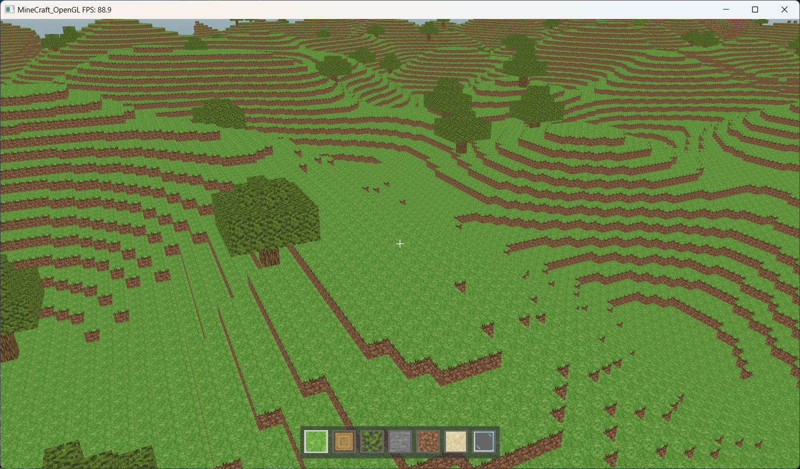
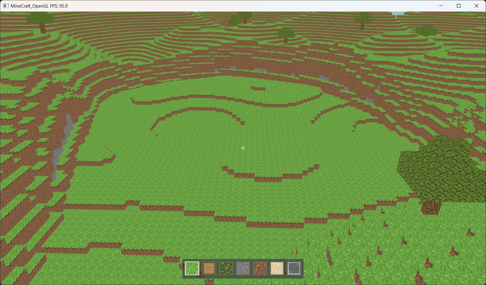
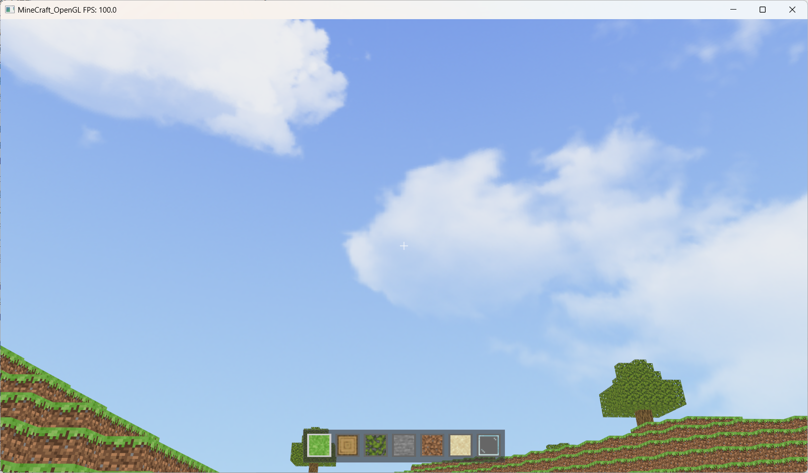
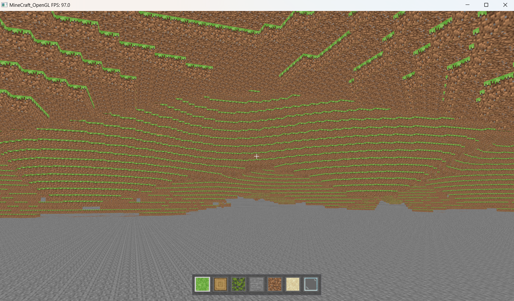
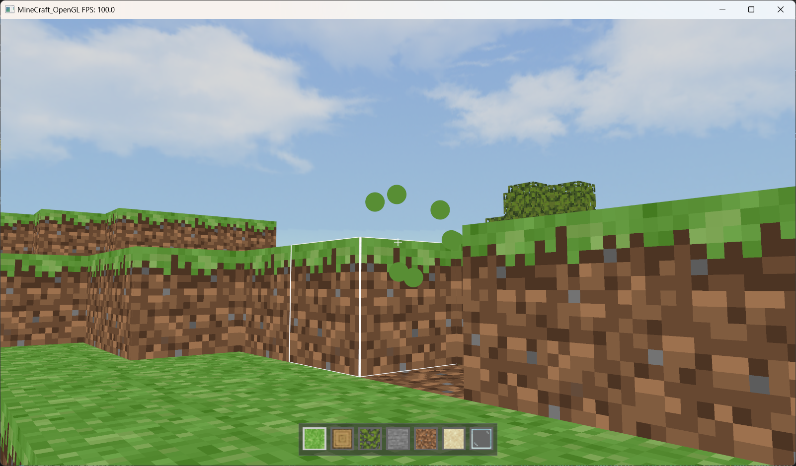
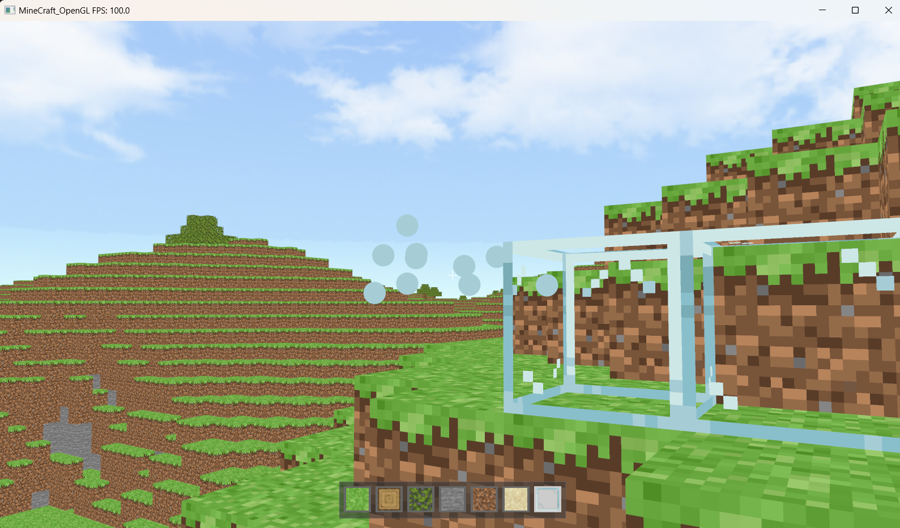

 

# 计算机图形学期末大作业-小组报告

**题目：基于OpenGL的简易Minecraft沙盒游戏开发与渲染效果实现**                         

日期：2025/01/03

## 一、引言

本次期末大作业以“基于OpenGL的简易Minecraft沙盒游戏开发与渲染效果实现”为主题。我们小组采用OpenGL作为底层图形渲染框架，通过C++编程语言直接调用OpenGL的核心接口，使用自定义着色器实现了渲染效果的控制。这种底层开发方式使我们能够直接操作渲染相关的核心部分，深入理解计算机图形学的关键概念。

项目的目标是通过实践掌握3D图形渲染中的基础技术与高级应用，例如实时光影、物理碰撞检测、动态方块世界生成与管理等。相比于使用现成的游戏引擎，基于OpenGL的开发为我们提供了设计高效图形算法和优化渲染性能的实践机会，同时也提升了我们在计算机图形学领域的技术深度与问题解决能力。

## 二、游戏概述

该游戏是沙盒式建造游戏，玩家会出现在一个随机生成的地形中，可以通过删除和放置不同的方块来搭建自己喜欢的建筑。

游戏操作：玩家可以通过下表中所展示的按键进行操作，也可以通过移动鼠标来旋转视角。

| 按键事件    | 事件响应          | 按键事件 | 事件相应             |
| ----------- | ----------------- | -------- | -------------------- |
| W           | 前进              | Q        | 向左切换物品         |
| S           | 后退              | E        | 向右切换物品         |
| A           | 向左移动          | LMB      | 删除方块             |
| D           | 向右移动          | RMB      | 放置方块             |
| CTRL        | 疾走              | TAB      | 打开/关闭 观察者模式 |
| SHIFT       | 下降(飞行模式)    |          |                      |
| 单击(SPACE) | 跳跃/上升         |          |                      |
| 双击(SPACE) | 开启/关闭飞行模式 |          |                      |

 

## 三、技术路线与方案

### 1. 技术框架

本游戏以 **OpenGL** 作为核心渲染框架，通过 **C++** 编程语言实现了窗口管理、输入处理、物理计算和渲染等功能。

#### 1.1 渲染框架

- **OpenGL** 提供了高性能的实时图形渲染能力，用于绘制游戏中的方块世界。通过着色器实现了纹理映射、光照计算以及昼夜交替的动态效果。
- 使用 **GLFW** 管理窗口创建和输入事件。通过 GLFW 提供的回调函数处理键盘和鼠标交互，增强了游戏的操作体验。
- **GLAD** 用于加载 OpenGL 函数，确保跨平台的兼容性。

#### 1.2 数学与物理支持

- **GLM**（OpenGL Mathematics）提供了强大的向量和矩阵运算库，用于实现摄像机操作、模型变换、投影等数学计算。
- 通过设置重力值模拟真实的物理效果，实现了玩家角色的下坠、跳跃和飞行。同时，基于精确的三维网格检测实现了人物与方块的碰撞判定。

#### 1.3 噪声生成与地形构建

- **FastNoiseLite** 被用于生成高度图，通过 Perlin 噪声模拟地形的高度变化，为游戏提供了丰富的随机世界生成能力。

#### 1.4 图形与纹理管理

- **stb_image** 用于加载图片文件，将纹理应用于游戏世界中的方块和天空盒。
- 通过 **纹理数组** 技术一次性加载多张材质，大大减少了运行时的纹理切换开销，提高了渲染效率。

#### 1.5 UI 组件

- 本游戏使用 **ImGui**库绘制玩家的物品栏界面，提供了简洁直观的用户交互方式。

### 2. 项目架构

为了更好地实现游戏功能，本项目进行了模块化设计，各个模块分工明确，共同保障游戏的功能性和可扩展性。以下是项目中各文件的职责说明：

**`World.hpp`**
 游戏世界生成和管理模块，负责生成随机地形、植被（如树木），并提供方块的增删操作接口。同时，该模块负责处理世界范围内的顶点缓冲管理和物理碰撞检测，实现玩家与世界的交互逻辑。

**`Player.hpp`**
 玩家控制模块，主要处理玩家的键盘和鼠标输入，实现玩家视角的旋转与移动。该模块还包括玩家与世界交互的实现，如方块的破坏与放置，内置了物理碰撞检测功能以避免玩家进入方块。

**`CrossHair.hpp`**
 准星渲染模块，用于在屏幕中央显示一个准星，帮助玩家对方块进行精准定位和交互。

**`Inventory.hpp`**
 物品栏渲染模块，在屏幕底部渲染一排物品栏，用于显示当前选中方块类型。支持切换物品栏中的方块。

**`Block.hpp`**
 方块类型定义模块，用于声明游戏中所有支持的方块类型（如草方块、原木方块、树叶方块）。提供方块的枚举类型和属性定义。

**`TextureManager.hpp`**
 纹理管理模块，负责加载和管理所有方块的纹理资源。该模块通过统一接口实现纹理的高效加载和映射，提升渲染效率。

**`Skybox.hpp`**
 天空盒渲染模块，用于模拟游戏场景的天空效果。实现了动态的天空渲染，包括白天、黑夜和云朵的渲染。

**`DayTime.hpp`**
 时间变化模块，控制游戏中的时间进程，模拟昼夜交替。该模块提供了白昼与夜晚的平滑过渡效果。

**`Shader.hpp`**
 着色器管理模块，提供着色器的加载、编译与链接功能。支持顶点着色器和片段着色器的管理。

**`GeometryShader.hpp`**
 几何着色器模块，是 `Shader.hpp` 的扩展，增加了几何着色器支持，用于渲染更复杂的场景（如线框）。

**`ParticleSystem.hpp`**
 粒子系统模块，用于模拟方块被破坏后的粉碎效果。通过动态的粒子效果提升游戏的视觉表现力。

**`FPSCounter.hpp`**
 帧率监控模块，用于检测并显示每秒刷新帧数（FPS），显示在窗口左上角，帮助开发者优化性能。

**`shaders/`**
 存放各种着色器代码，包括顶点着色器（`.vert`）、片段着色器（`.frag`）和几何着色器（`.geom`）。不同的文件实现特定场景的渲染需求，例如天空盒、粒子效果和线框渲染。

**`assets/`**
 资源文件夹，存放所有的游戏纹理，包括方块的纹理（如草方块顶部、侧面、底部），以及天空盒的贴图文件。

**`Makefile`**
 项目构建文件，定义了代码编译和链接的规则，方便开发者通过简单命令完成项目构建。


### 3.重要技术讲解

#### 3.1 地形生成

##### 3.1.1 基础Perlin噪声地形

在地形生成的核心部分，我们使用 **Perlin 噪声算法** 来生成地形的基础高度图。Perlin 噪声是一种连续平滑的随机噪声，能够模拟自然界中的地形变化，例如山脉、丘陵和平原。

```cpp
FastNoiseLite terrainNoise;
terrainNoise.SetNoiseType(FastNoiseLite::NoiseType_Perlin);
terrainNoise.SetFrequency(0.03f);  // 设置频率，频率越低，地形越平滑
int terrainSeed = rand32();
terrainNoise.SetSeed(terrainSeed);  // 设置种子，保证地形的可重复性
```

我们使用双层循环遍历每个地形点，并根据 Perlin 噪声的值来决定该点的高度。Perlin 噪声生成的值通常在 [-1, 1] 之间，为了将其映射到合理的高度范围，我们需要对其进行归一化处理：

```cpp
float terrainValue = terrainNoise.GetNoise((float)x, (float)z);
float normalizedTerrain = (terrainValue + 1.0f) / 2.0f;  // 将值映射到 [0, 1] 范围
int terrainHeight = (int)(normalizedTerrain * (worldHeight - 1)) + 1;  // 根据噪声值决定高度
```

这种方法会根据每个位置的噪声值生成不同的地形高度，形成自然的起伏地形。

##### 3.1.2 盆地生成算法

在基础的 Perlin 噪声地形生成之后，我们引入了 **盆地生成** 算法，通过 **生物群系噪声** 来模拟地形中的低洼区域，例如河流、湖泊或低地。

生物群系噪声的频率较低，能够生成大范围的平滑变化区域。通过判定噪声值是否高于一定的阈值，来确定某个区域是否属于盆地：

```cpp
FastNoiseLite biomeNoise;
biomeNoise.SetNoiseType(FastNoiseLite::NoiseType_Perlin);
biomeNoise.SetFrequency(0.01f);  // 设置频率，低频噪声有利于生成大范围的地形特征
biomeNoise.SetSeed(rand32());  // 设置种子值，保证每次生成的地形一致

float biomeValue = biomeNoise.GetNoise((float)x, (float)z);
bool isBasin = biomeValue > 0.2f;  // 设定一个阈值，将地形分为盆地和非盆地区域
```

当判定为盆地区域时，我们会将该区域的高度限制在较低的范围内，使得盆地形成明显的低洼地带。这样就能模拟出低地特征。

```cpp
int terrainHeight = isBasin
    ? (int)(normalizedTerrain * (worldHeight / 4 - 1)) + 1  // 盆地区域，高度限制在 worldHeight/4
    : (int)(normalizedTerrain * (worldHeight - 1)) + 1;     // 非盆地区域，使用普通地形高度
```

通过这种方法，我们能够为地形加入更多自然的变化，使其更具多样性和真实感。

##### 3.1.3 地形平滑处理

为了进一步改善生成的地形，使其更加自然和流畅，我们使用了 **地形平滑算法**。该算法的目标是消除地形中可能出现的突然高度变化（尤其是盆地与平原的边界处）。

通过限制相邻高度点之间的最大差值，地形会逐渐变得更加平滑。具体实现上，我们进行了多次迭代，每次都根据相邻点的高度对当前点进行调整：

```cpp
const int maxDelta = 2;  // 最大允许的高度差
const int iterations = 4;  // 平滑迭代次数
for (int iter = 0; iter < iterations; ++iter) {
    std::vector<std::vector<int>> newHeightMap = heightMap;  // 创建一个新的高度图用于存储平滑后的结果
    for (int x = 1; x < worldWidth - 1; ++x) {
        for (int z = 1; z < worldDepth - 1; ++z) {
            int& currentHeight = heightMap[x][z];
            for (int dx = -1; dx <= 1; ++dx) {
                for (int dz = -1; dz <= 1; ++dz) {
                    int neighborHeight = heightMap[x + dx][z + dz];
                    if (currentHeight < neighborHeight - maxDelta) {
                        newHeightMap[x][z] = currentHeight + (neighborHeight - currentHeight) / 2;
                    }
                }
            }
        }
    }
    heightMap = newHeightMap;  // 更新原始高度图
}
```

通过这种平滑处理，地形中的过于尖锐的高低差异被平滑掉，生成的地形看起来更加自然。

##### 3.1.4 树木生成

在完成地形和盆地生成后，我们为地形添加了 **树木生成**，以增加自然环境的多样性。

我们在生成树木时，首先需要判断某个位置是否适合放置树木，这包括检查该位置是否为草地，并且周围没有已存在的树木：

```cpp
const float treeDensity = 0.001f;  // 树木的密度
if (terrainHeight > 1 && rand32() % 10000 < treeDensity * 10000) {
    if (canPlaceTree(x, z)) {  // 判断是否可以放置树木
        placeTree(x, terrainHeight, z);  // 在合适的位置生成树木
    }
}
```

`placeTree` 函数负责在指定的位置生成树木，它会首先在树的底部放置树干，然后根据树的高度生成树叶：

```cpp
void placeTree(int x, int baseHeight, int z) {
    int treeHeight = 5 + rand() % 3;  // 随机生成树的高度，范围为 5 到 7
    for (int y = baseHeight; y < baseHeight + treeHeight - 1 && y < worldHeight-1; ++y) {
        setBlock(x, y, z, BlockType::OAK_LOG);  // 树干使用橡木方块
    }
    // 树叶的生成逻辑...
}
```

通过这种方式，我们可以在地形中随机生成树木，增强世界的自然感和生动性。





#### **3.2 人物操控**

##### **3.2.1 基本移动与方向控制**

玩家可以通过键盘 `W`、`A`、`S`、`D` 键进行基本的前后左右移动，同时鼠标控制玩家的视角旋转，提供沉浸式的操控体验。该模块基于 OpenGL 的 GLFW 库，实时捕获键鼠事件并更新玩家的位置和视角。
 通过计算玩家的前方向（`front`）和右方向（`right`），动态调整移动的方向和速度，支持多键组合操作，实现流畅的多向移动。

**水平移动：**
 根据玩家键盘输入更新移动方向，结合玩家速度计算最终位移。

```cpp
glm::vec3 direction(0.0f);
if (keys[GLFW_KEY_W]) direction += front;   // 向前移动
if (keys[GLFW_KEY_S]) direction -= front;   // 向后移动
if (keys[GLFW_KEY_A]) direction -= right;   // 向左移动
if (keys[GLFW_KEY_D]) direction += right;   // 向右移动
```

此外，我们还添加了疾走功能用于加速移动速度。按住左 Ctrl 键就会进入疾走模式。

```cpp
// 更新玩家位置
void updatePosition(float deltaTime) {
    // 根据是否疾跑来决定移动速度
    float currentSpeed = isSprinting ? sprintSpeed : normalSpeed;
    //...
}
```

**视角控制：**
 鼠标移动直接影响玩家的偏航角（yaw）和俯仰角（pitch），通过三角函数实时计算前方向向量，确保视角变化平滑自然。

```cpp
newFront.x = cos(glm::radians(yaw)) * cos(glm::radians(pitch));
newFront.y = sin(glm::radians(pitch));
newFront.z = sin(glm::radians(yaw)) * cos(glm::radians(pitch));
front = glm::normalize(newFront);
right = glm::normalize(glm::cross(front, worldUp));
```

##### **3.2.2 跳跃与重力模拟**

跳跃功能通过键盘 `Space` 键触发，仅当玩家站在地面上时可激活。垂直方向的速度（`velocity.y`）设置为初始跳跃速度，实现玩家的上升动作。重力模拟依赖加速度的连续叠加，在非飞行模式下不断调整玩家的垂直速度，结合空气阻力（`resistanceFactor`），逼真地再现跳跃与下落的物理效果。

**跳跃逻辑：**
 判断玩家是否站在地面上后，赋予垂直速度的初始值，实现跳跃行为。

```cpp
if (keys[GLFW_KEY_SPACE] && isOnGround()) {
    velocity.y = jumpSpeed;  // 初始化垂直速度
}
```

**重力影响：**
 当玩家未处于飞行模式时，重力会持续减少垂直速度，模拟自由下落。

```cpp
if (!isFlying) {
    velocity.y = (velocity.y + gravity.y * deltaTime) * resistanceFactor; // 应用重力与阻力
}
```

##### **3.2.3 飞行模式**

飞行模式允许玩家在三维空间中自由移动，并且关闭了重力模拟。玩家可以通过双击 `Space` 键开启或关闭飞行模式。我们使用时间戳记录键盘事件，通过检测两次按键间的时间间隔是否小于预设值（`doubleClickTime`）来实现双击判断。

- **飞行模式切换：**
  双击 `Space` 切换飞行模式，并重置玩家的速度，避免模式切换时造成位置异常。

```cpp
if (currentSpaceState && !lastSpaceState) {
    float currentTime = glfwGetTime();
    if (currentTime - lastSpacePressTime < doubleClickTime) {
        isFlying = !isFlying; // 切换飞行模式
        velocity = glm::vec3(0.0f); // 重置速度
    }
    lastSpacePressTime = currentTime;
}
```

- **飞行模式移动：**
  玩家可通过 `Space` 和 `Shift` 键进行上下移动，自由探索游戏场景。

```cpp
if (isFlying) {
    if (keys[GLFW_KEY_SPACE]) direction += worldUp;       // 向上飞行
    if (keys[GLFW_KEY_LEFT_SHIFT]) direction -= worldUp;  // 向下飞行
}
```

##### **3.2.4 观察者模式**

观察者模式不仅关闭了重力系统，还关闭了碰撞检测，允许玩家在三维空间中自由移动，穿越地形阻挡。玩家可以通过单击 `TAB` 键开启观察者模式。

观察者模式下的移动与飞行模式相同，玩家可通过 `Space` 和 `Shift` 键进行上下移动，自由探索游戏场景。

#### 3.3 移动碰撞检测

玩家在移动过程中需要不断检测其潜在位置是否与地图中的方块发生碰撞。以下分步骤说明移动过程中碰撞检测的具体实现。

##### 3.3.1 确定边界体积

边界体积是玩家在游戏世界中的占用空间的描述。计算边界体积需要考虑玩家的当前位置和体型信息：

1. **玩家体型参数**
    玩家体型用高度和宽度来描述：

   - **高度**：包括玩家的实际高度和摄像机的相对位置。
   - **宽度**：玩家的水平占用宽度，用中心点左右的范围表示（半宽）。

2. **边界计算**
    利用玩家的位置（`position`）计算边界的最小点（`minBound`）和最大点（`maxBound`）。

   - 最小边界点：

     ```cpp
     glm::vec3 minBound = position - glm::vec3(halfPlayerWidth, cameraHeight, halfPlayerWidth);
     ```

   - 最大边界点：

     ```cpp
     glm::vec3 maxBound = position + glm::vec3(halfPlayerWidth, playerHeight - cameraHeight, halfPlayerWidth);
     ```

3. **边界体积的意义**
    `minBound` 和 `maxBound` 定义了玩家的一个立方体包围盒，用于检测与周围方块的碰撞。

##### 3.3.2 计算潜在位置

在玩家移动过程中，需要通过玩家速度和时间步长预测下一帧的位置，这个位置被称为潜在位置。

1. **玩家速度**
    玩家速度 (`velocity`) 是一个三维向量，包含 X、Y、Z 三个方向的分量。

   - 水平速度由玩家的输入（如 W、A、S、D 键）决定。
   - 垂直速度可能受重力影响。

2. **时间步长**
    时间步长 (`deltaTime`) 表示两帧之间的时间间隔，用于将速度换算为位移。

3. **潜在位置计算**
    根据公式 `potentialPosition = position + velocity * deltaTime` 计算：

   ```cpp
   glm::vec3 potentialPosition = position + velocity * deltaTime;
   ```

##### 3.3.3 步进检测

步进检测是将玩家的包围盒分解为多个点进行碰撞检测的一种方式，确保在较大的包围盒内准确捕捉到与方块的碰撞。

1. **步进大小**
    步进大小 (`step`) 决定了检测的精度，值越小，检测越精细，但性能开销更大。由于该游戏方块世界的特性，这里选择 `step = 0.3f`已经足够精细。

2. **遍历范围**
    遍历玩家的包围盒范围内的所有点。对于 X、Y、Z 每个方向，按步长递增检测：

   ```cpp
   for (float x = minBound.x; x < maxBound.x; x += step) {
       for (float y = minBound.y; y < maxBound.y; y += step) {
           for (float z = minBound.z; z < maxBound.z; z += step) {
               int blockX = static_cast<int>(std::floor(x));
               int blockY = static_cast<int>(std::floor(y));
               int blockZ = static_cast<int>(std::floor(z));
   
               if (getBlock(blockX, blockY, blockZ) != BlockType::BLOCK_AIR) {
                   return true;  // 如果有非空气方块，发生碰撞
               }
           }
       }
   }
   ```

    同时，对于包围盒的边界需要进行一次特殊的检测。
   
3. **检测结果**

   - 如果包围盒内有非空气方块，则视为碰撞。
   - 否则，潜在位置是安全的。

##### 3.3.4 碰撞响应

一旦检测到碰撞，需要对玩家的速度和位置作出调整，保证玩家不会进入方块内部。

每次只更新一个方向（如 X 方向），检测是否碰撞。如果碰撞，恢复原始位置，并停止该方向的速度：

```cpp
nextPosition.x = position.x;
velocity.x = 0.0f;
```

##### 3.3.5 更新最终位置

在所有方向的检测完成后，将经过调整的 `nextPosition` 作为玩家的新位置：

```cpp
position = nextPosition;
```

这样可以保证玩家的位置始终在合法范围内，并避免穿过方块的情况发生。3.4 纹理管理与贴图实现

纹理管理和贴图是游戏渲染的重要部分，为方块赋予真实感的外观。在本项目中，我们设计了一个 **`TextureManager`** 模块，用于加载和管理所有纹理。


#### 3.4 纹理管理

##### **3.4.1 纹理管理模块设计**

为便于管理不同类型的方块纹理，项目采用了纹理数组的形式，预先加载所有纹理到 GPU，并通过纹理层索引在渲染时快速访问。

**纹理类型定义：**
 通过 `enum TextureType` 列出所有支持的纹理类型（如草方块、树干、树叶等）。

```cpp
enum TextureType {
    TEXTURE_AIR, 
    GRASS_BLOCK_TOP,
    GRASS_BLOCK_SIDE,
    GRASS_BLOCK_BOTTOM,
    // ...
};
```

**纹理文件路径：**
 所有纹理图片存放在 `assets` 文件夹中，并通过 `std::vector` 列表维护其路径。

```cpp
std::vector<std::string> texture_imgs = {
    "assets/grass_block_top.png",
    "assets/grass_block_side.png",
    "assets/grass_block_bottom.png",
    // ...
};
```

##### **3.4.2 纹理加载流程**

纹理的加载采用了 **`stb_image`** 库完成图片文件的读取，并通过 OpenGL 的 `glTexImage3D` 方法将纹理存储到 GPU 的 2D 纹理数组中。

**分配纹理数组：**
 调用 `glTexImage3D` 创建一组层级纹理空间，确定宽高和层数。

**逐层加载纹理：**
 遍历纹理路径列表，读取每张图片的数据并上传到对应的纹理层。

```cpp
for (size_t i = 0; i < texture_imgs.size(); ++i) {
    data = stbi_load(texture_imgs[i].c_str(), &width, &height, &nrChannels, 4);
    if (data) {
        glTexSubImage3D(GL_TEXTURE_2D_ARRAY, 0, 0, 0, i + 1, width, height, 1, GL_RGBA, GL_UNSIGNED_BYTE, data);
        stbi_image_free(data);
    }
}
```

**设置纹理参数：**
 定义纹理的过滤和边界行为，确保高质量渲染效果。

```cpp
glTexParameteri(GL_TEXTURE_2D_ARRAY, GL_TEXTURE_MIN_FILTER, GL_NEAREST);
glTexParameteri(GL_TEXTURE_2D_ARRAY, GL_TEXTURE_MAG_FILTER, GL_NEAREST);
glTexParameteri(GL_TEXTURE_2D_ARRAY, GL_TEXTURE_WRAP_S, GL_REPEAT);
glTexParameteri(GL_TEXTURE_2D_ARRAY, GL_TEXTURE_WRAP_T, GL_REPEAT);
```

##### 3.4.3 方块的纹理绑定

每个方块的表面映射不同纹理层，通过 `getCubeVertices` 函数生成包含纹理层信息的顶点数据。

在生成过程中，对顶部、侧面、底部纹理进行区分（例如草方块顶部为草地纹理，底部为泥土纹理）。

在顶点数据中，为每个面指定位置、纹理坐标和纹理层信息，然后在着色器中从纹理数组选择正确的纹理。

```cpp
std::vector<float> getCubeVertices(float x, float y, float z, int blockType) {
    std::vector<float> cubeVertices(blockStride);

    TextureType textureTypeTop;
    TextureType textureTypeSide; 
    TextureType textureTypeBottom; 

    if (blockType == BlockType::BLOCK_AIR) { // 空气方块
        textureTypeTop = TextureType::TEXTURE_AIR;
        textureTypeSide = TextureType::TEXTURE_AIR;
        textureTypeBottom = TextureType::TEXTURE_AIR;
    }
    else if (blockType == BlockType::GRASS_BLOCK) { // 草方块
        textureTypeTop = TextureType::GRASS_BLOCK_TOP;
        textureTypeSide = TextureType::GRASS_BLOCK_SIDE;
        textureTypeBottom = TextureType::GRASS_BLOCK_BOTTOM;
    }
    // ...

    cubeVertices = {
        // Front face (侧面纹理)
        x,     y,     z,     0.0f, 0.0f, float(textureTypeSide),
        x,     y + 1, z,     0.0f, 1.0f, float(textureTypeSide),
        x + 1, y + 1, z,     1.0f, 1.0f, float(textureTypeSide),
        x + 1, y + 1, z,     1.0f, 1.0f, float(textureTypeSide),
        x + 1, y,     z,     1.0f, 0.0f, float(textureTypeSide),
        x,     y,     z,     0.0f, 0.0f, float(textureTypeSide),
	// ...
```


#### 3.5 天空盒

天空盒的实现旨在为游戏提供动态背景，模拟昼夜变化的天空效果。通过立方体纹理映射和 OpenGL 的渲染管线实现，天空盒提供了逼真的环境渲染效果。

##### 3.5.1 着色器顶点网格

天空盒由一个包围整个场景的立方体构成，其顶点坐标定义在 `[-1, 1]` 的范围内。共6个面，每个面由两个三角形构成，共36个顶点。

```cpp
const float skyboxVertices[108] = {
    -1.0f,  1.0f, -1.0f, // 顶点1
    -1.0f, -1.0f, -1.0f, // 顶点2
     1.0f, -1.0f, -1.0f, // 顶点3
    // 其他面顶点省略
};
```

##### 3.5.2 立方体纹理

天空盒的每个面对应一个纹理文件（如 `Right.bmp`、`Left.bmp` 等）。通过 `stbi_load` 加载图像数据，并使用 `glTexImage2D` 上传至 GPU 的立方体纹理。

```cpp
void loadCubemapTextures() {
    std::vector<std::string> faces = {
        "assets/DaylightBox_Right.bmp",
        "assets/DaylightBox_Left.bmp",
        // 其他纹理路径
    };
    for (GLuint i = 0; i < faces.size(); i++) {
        int width, height, nrChannels;
        unsigned char* data = stbi_load(faces[i].c_str(), &width, &height, &nrChannels, 0);
        if (data) {
            glTexImage2D(GL_TEXTURE_CUBE_MAP_POSITIVE_X + i, 0, GL_RGB, width, height, 0, GL_RGB, GL_UNSIGNED_BYTE, data);
            stbi_image_free(data);
        } else {
            std::cerr << "Failed to load texture: " << faces[i] << std::endl;
        }
    }
}
```

##### 3.5.3 动态天空效果

1. **昼夜过渡：**通过 `DayTime` 模块获取昼夜混合因子，将其传递给片段着色器，动态调整天空盒的颜色和亮度。

   ```glsl
   #version 330 core
   
   in vec3 TexCoords;
   out vec4 FragColor;
   
   uniform samplerCube skybox;
   uniform float dayNightBlendFactor;
   
   void main() 
   {
       vec3 dayNightBlendColor = vec3(dayNightBlendFactor);
       // 取样天空盒纹理
       vec4 color = texture(skybox, TexCoords);
   
       // 将当前时间段的颜色乘到纹理上
       FragColor = vec4(color.rgb * dayNightBlendColor, color.a);
   }
   ```

2. **渲染逻辑：**天空盒渲染前，禁用深度缓冲更新 (`glDepthFunc(GL_LEQUAL)`)，确保天空始终在其他物体后面。

   ```cpp
   void render(const glm::mat4& view, const glm::mat4& projection) {
       glDepthFunc(GL_LEQUAL);
       skyboxShader.use();
       glm::mat4 skyView = glm::mat4(glm::mat3(view)); // 移除平移部分
       skyboxShader.setUniformMatrix4fv("view", glm::value_ptr(skyView));
       skyboxShader.setUniformMatrix4fv("projection", glm::value_ptr(projection));
       skyboxShader.setUniform1f("dayNightBlendFactor", DayTime::getDayNightBlendFactor());
       glBindVertexArray(skyboxVAO);
       glBindTexture(GL_TEXTURE_CUBE_MAP, cubemapTexture);
       glDrawArrays(GL_TRIANGLES, 0, 36);
       glDepthFunc(GL_LESS);
   }
   ```



#### 3.6 世界渲染与更新

##### 3.6.1 渲染管线与着色器实现

世界的渲染依托于 OpenGL 渲染管线，采用顶点着色器和片元着色器协作完成。其中，顶点着色器负责将三维空间中的顶点坐标转换到屏幕坐标系，同时传递纹理坐标和材质信息至片元着色器；片元着色器则负责采样纹理、处理透明像素以及应用光照效果。

- **顶点着色器：** 顶点着色器接受每个顶点的位置、纹理坐标和材质信息（通过 `TextureType`），计算顶点在屏幕上的位置并将相关信息传递给片元着色器。使用的矩阵包括视图矩阵和投影矩阵，用于完成从世界坐标到屏幕坐标的变换。

  **代码片段：**

  ```glsl
  uniform mat4 view;
  uniform mat4 projection;
  
  void main() {
      gl_Position = projection * view * vec4(aPos, 1.0);  // 转换到屏幕坐标
      TexCoord = aTexCoord;
      TextureType = int(textureType);
  }
  ```

- **片元着色器：** 片元着色器从纹理数组中根据材质信息采样颜色，并应用昼夜光照因子进行颜色调整。对于透明像素，片元着色器会丢弃这些像素以支持透明效果。

  **光照与透明处理逻辑：**

  ```glsl
  if (textureColor.a < 0.01) {
      discard; // 丢弃透明像素
  }
  FragColor = vec4(textureColor.rgb * dayNightBlendColor, textureColor.a);
  ```

- **纹理数组的使用：** 我们使用了纹理数组 (`sampler2DArray`) 来管理方块材质信息。每种材质对应纹理数组中的一个图层，避免了频繁切换纹理，提高了渲染效率。

##### 3.6.2 昼夜光照与动态渲染

世界渲染实现了昼夜交替的动态光照效果。通过一个时间驱动的光照混合因子 (`dayNightBlendFactor`)，我们实现了从白天到夜晚的平滑过渡。

- **光照因子更新：** `dayNightBlendFactor` 值随着时间的变化而动态调整，在片元着色器中对纹理采样结果进行加权处理，从而达到昼夜效果的变化。

  ```cpp
  float getDayNightBlendFactor() {
      // 将当前时间映射到 0~1 的周期
      float timeRatio = currentTime / dayLength;
      // 基于正弦函数的平滑过渡，调整输出到 [0.1, 1.0]
      return 0.1f + 0.9f * (0.5f * (1.0f + sin(2.0f * PI * timeRatio - PI / 2.0f)));
  }
  ```

- **光照效果：** 白天场景会显示明亮的材质颜色，而夜晚则逐渐减弱亮度，模拟真实环境的光照变化。这种方式对场景整体光照进行了统一管理，既简单又高效。

##### 3.6.3 高效缓冲管理

为了支持大规模的世界渲染，所有方块的顶点数据均存储在一个连续的顶点缓冲区（VBO）中，并通过批量绘制完成渲染。

- **批量绘制：** 渲染时使用 `glDrawArrays` 直接绘制所有有效的顶点数据。通过 VAO（顶点数组对象）绑定和 VBO 数据管理，减少了 GPU 调用的频率。

  ```cpp
  glDrawArrays(GL_TRIANGLES, 0, vaoSize * vertexCountPerBlock);
  ```

- **顶点缓冲区的初始化：** 在生成地图时，提前分配足够大的缓冲区空间，并使用 `glBufferData` 将初始数据上传至 GPU。

##### 3.6.4 方块添加与删除的优化策略

在方块的添加和删除过程中，为了维持高性能，我们结合了以下两种策略：

- **复用机制：** 当方块被删除时，相关的 VAO 索引被加入一个空闲池 (`airIndices`)。后续添加新方块时，优先从空闲池中复用索引，而非重新分配 GPU 内存。

- **增量更新：** 每次更新仅修改受影响方块的顶点数据，而不是重新上传整个缓冲区。通过 `glBufferSubData` 接口，可以高效地将更新后的数据写入 GPU。

  代码示例：

  ```cpp
  void addBlock(int x, int y, int z, BlockType type) {
      if (!airIndices.empty()) {
          int vaoIndex = airIndices.back();
          airIndices.pop_back();
          glBufferSubData(GL_ARRAY_BUFFER, vaoIndex * blockStride * sizeof(float), blockVertices.size() * sizeof(float), blockVertices.data());
      }
  }
  ```

#####  3.6.5 遮挡剔除优化

在世界渲染中，只需渲染可见的方块，从而显著减少 GPU 的负担。我们通过邻居检测实现可见性判断，并结合增量更新优化性能。

**（1）方块可见性判断**

判断逻辑：如果当前方块至少有一个邻居是空气、透明方块，或超出边界，则该方块可见。

```cpp
bool isBlockVisible(int x, int y, int z) {
    BlockType type = getBlock(x, y, z);
    if (type == BlockType::BLOCK_AIR) return false;

    for (auto& dir : dirs) {
        int nx = x + dir[0], ny = y + dir[1], nz = z + dir[2];
        if (nx < 0 || nx >= worldWidth || ny < 0 || ny >= worldHeight || nz < 0 || nz >= worldDepth ||
            isTransparent(getBlock(nx, ny, nz))) {
            return true;
        }
    }
    return false;
}
```

**（2）增量更新机制**

方块的添加或移除仅影响其自身及相邻方块的可见性：

```cpp
void updateVisibility(int x, int y, int z) {
    if (x < 0 || x >= worldWidth || y < 0 || y >= worldHeight || z < 0 || z >= worldDepth) return;

    bool visible = isBlockVisible(x, y, z);
    if (visible != visibleBlocks[x][y][z]) {
        visibleBlocks[x][y][z] = visible;
        visible ? addBlockToGPU(x, y, z) : removeBlockFromGPU(x, y, z);
    }
}
```

当操作方块时，触发当前方块和邻居方块的更新：

```cpp
void addBlock(int x, int y, int z, BlockType type) {
    setBlock(x, y, z, type);
    updateVisibility(x, y, z);
    for (auto& dir : dirs) updateVisibility(x + dir[0], y + dir[1], z + dir[2]);
}
```

**（3）优化效果**

- 渲染仅限于可见方块，显著减少了顶点数据传输和绘制调用。
- 支持动态世界更新，提升玩家交互和大规模场景渲染的性能。



（图为观察者模式演示遮挡剔除优化效果，该优化避免了对内部不可见方块的绘制）

#### 3.7 玩家与世界的交互

##### 3.7.1 方块删除

**（1）检测目标方块位置**

- 使用 `World::detectSelectedBlock` 方法沿玩家视线方向检测目标方块位置。
- 输入参数为玩家的当前位置 `position` 和视线方向 `front`，检测到的目标方块位置存储在 `blockHit` 中。

```cpp
if (world.detectSelectedBlock(position, front, blockHit)) {
    // 检测成功，blockHit 为目标方块位置
}
```

**（2）更新目标方块为空气块**

- 调用 `World::updateBlock` 方法，将目标方块替换为空气块，实现删除功能。该方法实现了上述提到的世界渲染优化方法。
- 删除操作会触发粒子效果（方块破碎的视觉反馈），增强玩家操作的沉浸感。

```cpp
world.updateBlock(static_cast<int>(blockHit.x), static_cast<int>(blockHit.y), static_cast<int>(blockHit.z), BlockType::BLOCK_AIR);
```

##### 3.7.2 方块放置

**（1）检测目标空气块位置**

- 使用 `World::findLastAirBlock` 方法沿玩家视线方向检测最近的空气块位置。
- 输入参数包括玩家的当前位置 `position` 和视线方向 `front`，将检测到的目标空气块位置存储到 `blockHit` 中。

```cpp
if (world.findLastAirBlock(position, front, blockHit)) {
    // 检测成功，blockHit 为目标空气块位置
}
```

**（2）检查与玩家位置的冲突**

- 确保拟放置方块不会与玩家当前的位置发生物理冲突。
- 调用 `World::isCollidingWith` 方法检测目标位置是否与玩家边界框重叠，避免玩家被放置的方块卡住。

```cpp
glm::vec3 minBound = position + glm::vec3(-halfPlayerWidth, -cameraHeight, -halfPlayerWidth);
glm::vec3 maxBound = position + glm::vec3(halfPlayerWidth, playerHeight - cameraHeight, halfPlayerWidth);
if (!world.isCollidingWith(minBound, maxBound, static_cast<int>(blockHit.x), static_cast<int>(blockHit.y), static_cast<int>(blockHit.z))) {
    // 无冲突，可以放置
}
```

**（3）更新方块数据**

- 在确认位置无冲突后，调用 `World::updateBlock` 方法将目标空气块替换为玩家当前手持的方块类型。
- 手持方块类型 `blockInHand` 通过物品栏选中槽位动态决定，玩家可通过快捷键切换不同类型的方块。

```cpp
world.updateBlock(static_cast<int>(blockHit.x), static_cast<int>(blockHit.y), static_cast<int>(blockHit.z), blockInHand);
```

##### 3.7.3 射线检测机制

射线检测是方块删除和放置功能的关键，通过沿玩家视线方向发射射线检测方块的位置，精准实现对目标的操作。

**（1）检测目标非空气方块**

**`detectSelectedBlock` 方法**

- 射线从玩家位置出发，沿视线方向以固定步长 `step` 前进。
- 对射线路径上的点逐一检查，找到第一个非空气方块。
- 若找到，返回该方块的位置 `blockHit`。

```cpp
for (float distance = 0.0f; distance < maxDistance; distance += step) {
    glm::vec3 currentPos = playerPos + distance * rayDir;
    int x = static_cast<int>(currentPos.x);
    int y = static_cast<int>(currentPos.y);
    int z = static_cast<int>(currentPos.z);

    if (getBlock(x, y, z) > 0) { // 非空气方块
        blockHit = glm::vec3(x, y, z);
        return true;
    }
}
return false;
```

**（2）检测目标空气方块**

**`findLastAirBlock` 方法**

- 与`detectSelectedBlock`相似，但在检测到非空气方块之前，记录最后一个空气方块位置。
- 返回检测到的最近空气方块坐标 `blockHit`，供放置操作使用。

```cpp
for (float distance = 0.0f; distance < maxDistance; distance += step) {
    glm::vec3 currentPos = playerPos + distance * rayDir;
    int x = static_cast<int>(currentPos.x);
    int y = static_cast<int>(currentPos.y);
    int z = static_cast<int>(currentPos.z);

    if (getBlock(x, y, z) > 0) { // 非空气方块
        currentPos -= step * rayDir; // 回到上一个采样点
        blockHit = glm::vec3(static_cast<int>(currentPos.x), static_cast<int>(currentPos.y), static_cast<int>(currentPos.z));
        return true;
    }
}
return false;
```

##### 3.7.4 选中方块的线框效果

我们通过几何着色器来实现这个线框效果。几何着色器位于顶点着色器和片元着色器之间，能够对输入顶点产生新的顶点，生成新的图元。

实现线框的效果大致就是从顶点着色器输入一个方块的每一条边，然后将输入的边转换为具有一定宽度的四边形，从而实现线框效果。通过计算线段的方向向量和垂直于线段的偏移向量，生成四个顶点，并发射这些顶点以形成一个四边形带。然后在片元着色器中将其填充为白色。在使用 `glDrawArrays` 绘制时，这个函数需要传入图元类型为线段，这使得几何着色器能够正确解释输入的顶点。

```glsl
#version 330 core
layout (lines) in;             // 输入图元类型：线段
layout (triangle_strip, max_vertices = 4) out; // 输出图元类型：三角形带，最多 4 个顶点

uniform float lineWidth;        // 线宽

void main() {
    // 获取线段的两个端点（已经在顶点着色器中乘以了MVP矩阵）
    vec4 p1 = gl_in[0].gl_Position;
    vec4 p2 = gl_in[1].gl_Position;

    // 计算线段的方向向量
    vec4 diff = p2 - p1;

    // 计算垂直于线段的向量（用于偏移，在裁剪空间进行）
    vec2 offset = normalize(vec2(-diff.y, diff.x)) * lineWidth * 0.5;

    // 生成四边形的四个顶点
    gl_Position = p1 + vec4(offset, 0.0, 0.0);
    EmitVertex(); // 发射第一个顶点

    gl_Position = p1 - vec4(offset, 0.0, 0.0);
    EmitVertex(); // 发射第二个顶点

    gl_Position = p2 + vec4(offset, 0.0, 0.0);
    EmitVertex(); // 发射第三个顶点

    gl_Position = p2 - vec4(offset, 0.0, 0.0);
    EmitVertex(); // 发射第四个顶点

    EndPrimitive(); // 结束当前图元
}
```


#### 3.8 主渲染循环

渲染循环是周期性刷新画面的核心。在这个循环中，程序不断地执行以下步骤：

- **清空缓冲区：**清除颜色缓冲区和深度缓冲区，为新的一帧做准备。
- **更新摄像机视角：**根据玩家的位置和方向更新摄像机的视图矩阵。
- **渲染世界：**调用`world.render()`函数渲染3D世界。
- **渲染准心：**调用`crossHair.render()`函数在屏幕上渲染准心。
- **检测和渲染选中的方块：**如果玩家的视线方向上有方块，调用`world.renderWireframe()`函数渲染选中的方块。
- **显示FPS：**更新FPS计数器并显示。
- **渲染天空盒：**调用`skybox.render()`函数渲染天空盒。
- **更新时间：**调用`DayTime::update()`更新游戏内的时间。
- **更新粒子系统：**更新并渲染粒子系统。
- **处理ImGui帧：**处理`ImGui`（玩家物品栏UI）的渲染和事件。
- **交换缓冲区：**调用`glfwSwapBuffers()`交换前后缓冲区，显示新的一帧。
- **处理玩家输入：**处理键盘、鼠标等事件，根据玩家的输入更新玩家的视角、位置，以及处理玩家与世界的交互。


#### 3.9 粒子效果

##### 3.9.1 粒子的发射

`emit`函数用于在指定位置和基于方块类型发射粒子。

当方块被破坏时，会在该方块的位置产生10个粒子，每个粒子都以随机的速度和角度发射出去。粒子的生命是1，随着时间的流逝减小life，当粒子的生命减到零时，清除粒子并释放资源。

```cpp
void emit(const glm::vec3& position, BlockType blockType) {
    for (int i = 0; i < 10; i++) { // 每次产生10个粒子
        Particle p;
        p.position = position;
        
        // 随机速度
        float randomAngle = static_cast<float>(rand()) / RAND_MAX * 2.0f * 3.14159f;
        float randomSpeed = static_cast<float>(rand()) / RAND_MAX * 2.0f + 1.0f;
        p.velocity = glm::vec3(
            cos(randomAngle) * randomSpeed,
            static_cast<float>(rand()) / RAND_MAX * 2.0f + 2.0f, // 向上的速度
            sin(randomAngle) * randomSpeed
        );
        
        p.life = 1.0f;
        p.size = 80.0f;
        p.textureLayer = getTextureLayer(blockType); // 根据方块类型获取纹理层索引
        particles.push_back(p);
    }
}
```

##### 3.9.2 粒子状态的更新 

`update` 函数会更新粒子的状态，将寿命到期的粒子从渲染管线中去掉

每个粒子有属性 `life` 表示它的寿命。每过一个时间片，我们更新粒子的位置、速度以及大小等信息，并将寿命到期的粒子删掉。

```cpp
void ParticleSystem::update(float deltaTime) {
    for(auto it = particles.begin(); it != particles.end();) {
        // 更新粒子信息
        it->position += it->velocity * deltaTime;
        it->velocity.y -= 9.81f * deltaTime; // 重力
        it->life -= deltaTime;
        it->size -= deltaTime * 2.0f;
        // 判断粒子是否还要继续存在
        if(it->life <= 0.0f) {
            it = particles.erase(it);
        } else {
            ++it;
        }
    }
}
```

在粒子的片元着色器中，我们读取了对应方块的材质来使得粒子看起来更加真实。此外我们还考虑了粒子受到当前光照的影响。

```cpp
#version 330 core
in float vTextureLayer;
out vec4 FragColor;

uniform sampler2DArray textureArray;
uniform float dayNightBlendFactor;

void main() {
    vec2 texCoord = gl_PointCoord;
    vec3 dayNightBlendColor = vec3(dayNightBlendFactor);
    vec4 color = texture(textureArray, vec3(texCoord, vTextureLayer));
    FragColor = vec4(color.rgb * dayNightBlendColor, color.a);
}
```






#### 3.10 物品栏 UI

为了便于实现相关功能，我们使用了 [Imgui](https://github.com/ocornut/imgui) 依赖库。

大致来说，我们需要计算出物品栏的位置，检测现在的选中框，加载相应的材质图片。我们实现了物品栏随选中框前后移动。这使得我们可以在物品栏宽度不变的情况下，继续添加更多的方块显示。

```cpp
void render() {
    // 获取窗口大小
    ImGuiIO& io = ImGui::GetIO();
    float windowWidth = io.DisplaySize.x;
    float windowHeight = io.DisplaySize.y;

    // 计算物品栏位置
    float inventoryWidth = (SLOT_WIDTH + SLOT_SPACING) * (VISIBLE_SLOTS + 1); // 物品栏宽度
    float inventoryHeight = 65; // 物品栏高度
    float padding = 20; // 底部边距

    ImVec2 inventoryPos(
        (windowWidth - inventoryWidth) * 0.5f,  // 水平居中
        windowHeight - inventoryHeight - padding // 底部对齐
    );

    // 设置窗口位置和大小
    ImGui::SetNextWindowPos(inventoryPos, ImGuiCond_Always);
    ImGui::SetNextWindowSize(ImVec2(inventoryWidth, inventoryHeight));
    ImGui::PushStyleColor(ImGuiCol_WindowBg, ImVec4(0.2f, 0.2f, 0.2f, 0.6f)); // 半透明灰褐色
    ImGui::Begin("Inventory", nullptr, 
        ImGuiWindowFlags_NoTitleBar | 
        ImGuiWindowFlags_NoResize | 
        ImGuiWindowFlags_NoMove);

    // 自动调整scrollOffset确保选中的槽位可见
    if (selectedSlot < scrollOffset) {
        scrollOffset = selectedSlot;
    }
    if (selectedSlot >= scrollOffset + VISIBLE_SLOTS) {
        scrollOffset = selectedSlot - VISIBLE_SLOTS + 1;
    }

    // 渲染物品栏槽位
    for (int i = scrollOffset; i < std::min(scrollOffset + VISIBLE_SLOTS, INVENTORY_SIZE); i++) {
        if (i > scrollOffset) ImGui::SameLine();

        // 如果是选中的槽位,改变背景颜色
        if (i == selectedSlot) {
            ImGui::PushStyleColor(ImGuiCol_Button, ImVec4(0.8f, 0.8f, 0.8f, 1.0f));
        }
        else {
            ImGui::PushStyleColor(ImGuiCol_Button, ImVec4(0.4f, 0.4f, 0.4f, 1.0f)); // 默认槽位的灰色
        }
        // 槽位标签
        std::string label = "##slot" + std::to_string(i);
        // 材质索引
        ImTextureID textureIndex = static_cast<intptr_t>(textureViews[(getTextureLayer(slots[i]))]);
        // 创建按钮代表槽位
        ImGui::ImageButton(label.c_str(),
            textureIndex, 
        ImVec2(40, 40)
        );

        ImGui::PopStyleColor();
    }

    ImGui::End();
    ImGui::PopStyleColor(); // 恢复窗口背景颜色
}
```


### 四、总结

通过本次计算机图形学期末大作业，我们成功实现了基于OpenGL的简易Minecraft沙盒游戏开发与渲染效果，涵盖了从地形生成、玩家操控到方块交互与粒子效果等丰富的技术模块。与现成的游戏引擎相比，我们选择直接使用OpenGL这一底层渲染框架，不仅获得了对渲染过程更高的控制权，还加深了对核心图形学算法的理解。

项目的完成也离不开团队的协作与创新。通过明确分工、紧密配合，我们克服了在物理碰撞优化、渲染性能提升等方面的挑战。此次大作业不仅是我们对计算机图形学知识的总结与应用，更为后续深入研究图形学技术奠定了坚实的基础。
